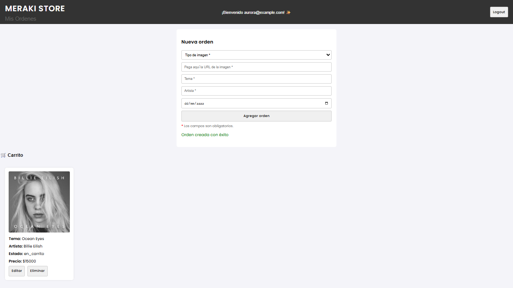
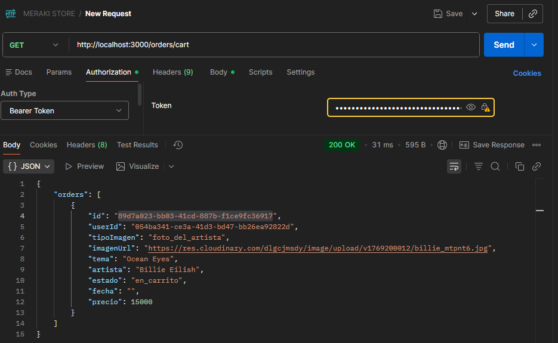
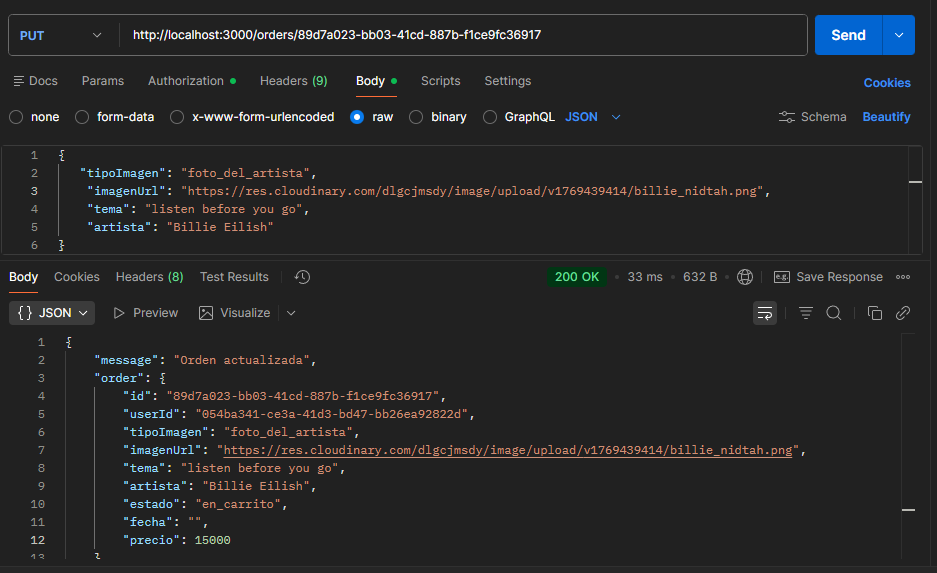

# PROYECTO INTEGRADOR FINAL APIREST 🚀

## MERAKI STORE ✨

- [Descripción](#descripción)
- [Requisitos](#requisitos)
- [Instalación](#instalación)
- [Estructura del proyecto](#estructura-del-proyecto)
- [Endpoints y funcionalidades](#endpoints-y-funcionalidades)
- [Ejecutar el proyecto](#ejecutar-el-proyecto)
- [Usuarios de prueba (Render)](#usuarios-de-prueba-render)
- [Flujo de uso típico](#flujo-de-uso-típico)
- [Notas finales](#notas-finales)

## Descripción
Este proyecto representa un emprendimiento de cuadros Spotify Glass, en el cual se desarrolló una **API REST** que permite gestionar usuarios y órdenes personalizadas.

La API implementa **autenticación con JWT**, **roles (user / admin)** y **persistencia en archivos JSON**, simulando una base de datos.

## Funcionalidades

**Como usuario podés:**
- Registrarte  
- Loguearte  
- Visualizar tu perfil (id, email y rol)  
- Agregar una orden  
- Editar una orden (solo si se encuentra en estado *en_carrito*)  
- Eliminar una orden  

**Como admin podés (además de lo anterior):**
- Visualizar todas las órdenes cargadas en la base de datos  
- Cambiar el estado de una orden a *confirmado* o *cancelado*  

### Tecnologías utilizadas

- Node.js  
- Express  
- TypeScript  
- JWT (jsonwebtoken)  
- Zod (validaciones)  
- Bcrypt (hash de contraseñas)  

## Requisitos
* Node.js ≥ 18
* npm
* git para clonar el repositorio

Además, se requiere crear un archivo `.env` en la raíz del proyecto con la siguiente variable:
- SECRET_KEY=valorDeLaVariable

- PORT=puerto designado

### Dependencias principales

El proyecto utiliza las siguientes bibliotecas:

- express  
- uuid  
- jsonwebtoken  
- bcrypt  
- cors  
- dotenv  
- nodemon (opcional)
---

### Instalación

1. Clonar el repositorio:

``git clone https://github.com/AymaraC/MERAKI_STORE``

2. Entrar a carpeta del proyecto:

``cd MERAKI_STORE-API``

3. Instalar dependencias:

``npm install``

4. Crear un archivo ``.env`` en la raíz del proyecto

> Nota: La clave puede ser cualquier string.
Es obligatoria para que funcione la autenticación con JWT.

## Estructura del proyecto

````
📁 ARCHIVOS BACK

├─ server.ts                   # Archivo principal que levanta el servidor
├─ controllers/                # Lógica de negocio
│   ├─ ordersController.ts
│   └─ usersController.ts
├─ models/                     # Acceso y manejo de datos (JSON)
│   ├─ usersModel.ts
│   └─ ordersModel.ts
├─ middleware/                 # Middlewares y validaciones
│   ├─ authMiddleware.ts
│   ├─ errMiddleware.ts
│   └─ globalMiddleware.ts
├─ routes/                    # Endpoints de la API
│   └─ routes.ts
├─ types/                     # Tipos personalizados
│   └─ express.d.ts
├─ scripts/                   # Scripts auxiliares
│   └─ initAdmin.ts
├─ data/                      # Archivos JSON que almacenan la información
│   ├─ orders.json
│   └─ users.json
└─ README.md                  # Documentación del proyecto


📁 ARCHIVOS FRONT

├─ index.html
├─ login.html
├─ script.js                  # Lógica principal del frontend
└─ style.css                  # Estilos de la aplicación
````

## Endpoints y funcionalidades

### 👤 Usuarios

#### **Registrar usuario**  
`POST /users/register`  
Crea un nuevo usuario con los datos enviados en el body.  
📌 Respuesta esperada:  
- Usuario registrado con éxito  
⚠️ Si ya existe:  
- Error indicando que el usuario ya está registrado.

---

#### **Iniciar sesión**  
`POST /users/login`  
Autentica al usuario y devuelve un token JWT.  
📌 Respuesta esperada:  
- Login exitoso + token  
🚫 Si las credenciales son inválidas:  
- Mensaje de error.

---

#### **Ver perfil**  
`GET /user/profile`  
Devuelve la información del usuario autenticado.  
🔐 Requiere autenticación.  
📌 Respuesta esperada:  
- Datos del usuario logueado.

---

### 📦 Órdenes

#### **Listar todas las órdenes (admin)**  
`GET /orders`  
Devuelve todas las órdenes del sistema.  
🔐 Requiere autenticación.  
👑 Solo administrador.  
📌 Respuesta esperada:  
- Listado completo de órdenes.

---

#### **Ver carrito del usuario**  
`GET /orders/cart`  
Devuelve las órdenes del usuario autenticado (carrito).  
🔐 Requiere autenticación.  
📌 Respuesta esperada:  
- Órdenes del usuario.

---

#### **Agregar orden**  
`POST /orders`  
Crea una nueva orden para el usuario autenticado.  
🔐 Requiere autenticación.  
📌 Respuesta esperada:  
- Orden creada con éxito.

---

#### **Editar orden completa**  
`PUT /orders/:id`  
Modifica todos los datos de una orden existente.  
🔐 Requiere autenticación.  
📌 Respuesta esperada:  
- Orden actualizada con éxito.  
🚫 Si no existe:  
- Mensaje de error.

---

#### **Cambiar estado de la orden (admin)**  
`PATCH /orders/:id/status`  
Permite al administrador cambiar el estado de una orden.  
🔐 Requiere autenticación.  
👑 Solo administrador.  
📌 Respuesta esperada:  
- Estado actualizado con éxito.

---

#### **Eliminar orden**  
`DELETE /orders/:id`  
Elimina una orden existente.  
🔐 Requiere autenticación.  
📌 Respuesta esperada:  
- Orden eliminada con éxito.  
🚫 Si no existe:  
- Mensaje de error.


## Ejecutar el proyecto
1. Iniciar el backend:

``npm run dev``  (en el caso de haber descargado nodemon) sino utilizar ``npx ts-node server.ts``

El servidor se levantará en:

http://localhost:3000

## Usuarios de prueba (Render)

Para facilitar las pruebas en producción (deploy en Render), se incluyen usuarios ya creados en los archivos JSON.

> ⚠️ Nota  
> Render utiliza un filesystem efímero, por lo que los usuarios y órdenes creados en producción no persisten entre reinicios del contenedor.  
> Por este motivo, estos usuarios vuelven a existir cada vez que Render reinicia el servicio.

### Usuario común

- **Email:** demo@meraki.com  
- **Contraseña:** 123456  
- **Rol:** user  

### Usuario administrador

- **Email:** admin@meraki.com  
- **Contraseña:** admin123  
- **Rol:** admin  


## Ejemplos de uso

### 📷 Capturas de pantalla

### **Creamos orden desde el Front**




### Ejemplos de uso desde Postman
**Traer órdenes del carrito**  
Con el token generado en el login, el usuario obtiene las órdenes de su carrito.  
Solo puede traerlas el usuario al que pertenece la orden.





**Actualizar una orden**  
Con el mismo token, el usuario puede actualizar la orden siempre y cuando su estado sea: `en_carrito`.




**Refrescar el Front para verificar cambios**  
Por último, actualizamos la página del Front para comprobar que los cambios se reflejen correctamente.


## Flujo de uso típico

Este es un ejemplo del flujo normal de uso de la API desde que un usuario se registra hasta que gestiona una orden.

1️⃣ **Registro de usuario**  
`POST /users/register`  
El usuario crea una cuenta enviando sus datos.

---

2️⃣ **Login de usuario**  
`POST /users/login`  
El usuario inicia sesión y obtiene un token JWT.

---

3️⃣ **Ver perfil**  
`GET /user/profile`  
Con el token en el header `Authorization`, el usuario puede ver su perfil.

---

4️⃣ **Crear una orden**  
`POST /orders`  
El usuario autenticado crea una nueva orden.  
📌 La orden queda en estado: `en_carrito`.

---

5️⃣ **Ver carrito**  
`GET /orders/cart`  
El usuario obtiene todas sus órdenes en estado carrito.

---

6️⃣ **Editar orden**  
`PUT /orders/:id`  
El usuario modifica una orden existente mientras esté en estado: `en_carrito`.

---

7️⃣ **Confirmar orden (admin)**  
`PATCH /orders/:id/status`  
El administrador cambia el estado de la orden (por ejemplo: `confirmada`).

---

8️⃣ **Eliminar orden (opcional)**  
`DELETE /orders/:id`  
El usuario o el administrador elimina una orden según las reglas del sistema.


## Notas finales

### Compilación y carpeta `dist`

El proyecto está desarrollado en **TypeScript**, por lo que se utiliza un proceso de compilación para generar los archivos JavaScript finales **necesarios para el despliegue en Render**.

- La carpeta `source/` contiene el código fuente en TypeScript.
- La carpeta `dist/` contiene el código compilado en JavaScript, generado automáticamente mediante el comando:

``npm run predeploy
``

Este proceso es necesario porque Render ejecuta la aplicación a partir de los archivos JavaScript compilados, no directamente desde TypeScript.

Durante el despliegue en Render se ejecuta un script de predeploy que:

* Compila el proyecto con tsc.

* Copia la carpeta source/database dentro de dist/database,
ya que los archivos JSON no son procesados por TypeScript.

**Otro punto importante para informar**

Render usa un filesystem efímero, por lo que los cambios en archivos JSON no persisten entre reinicios del contenedor.

Localmente sí persiste porque se escribe en disco real.

Para producción la solución correcta sería una base de datos real,
pero para la entrega usé JSON como storage. 
Por lo tanto, las órdenes se crean, se editan y se borran solo mientras el servidor esté en ejecución.


### 👤 Autor
Aymara Cabanal

GitHub: https://github.com/AymaraC

Email: aymicabanal@hotmail.com


